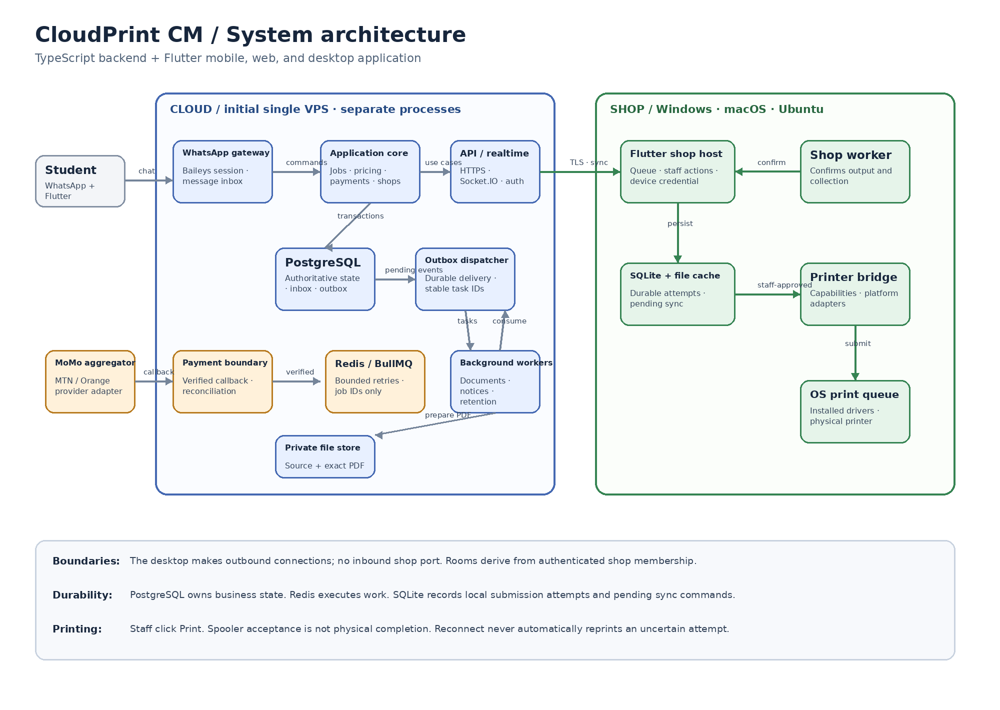

# CloudPrint CM system design

Status: proposed implementation baseline, 2 October 2026. Stack: TypeScript backend and Flutter client application.

The editable five-page source is [cloudprint-architecture.drawio](cloudprint-architecture.drawio). Mobile, web, and desktop client responsibilities are in [client-apps.md](client-apps.md).

## Product flow

CloudPrint turns WhatsApp document orders into paid, shop-specific print jobs. A student selects a shop, uploads one PDF or DOCX, selects black-and-white or colour and a copy count, confirms a quote, and approves a Mobile Money request. The backend verifies the result, queues the exact prepared PDF to the selected shop, and the shop worker chooses when to print it. The student receives a short ticket and collects the finished document.

WhatsApp remains the pilot upload and configuration channel. Flutter mobile and web add tracking, ticket/receipt access, support, shop operations, and administration. A paired Flutter desktop printer host is the only client that can cache a paid PDF for offline fulfilment or submit it to the operating system print queue.

Initial print assumptions are A4, simplex, all pages, one source file per job, a shop-specific per-page rate, and a 50 XAF convenience fee per job. Those are product settings, not hard-coded rules. Amounts are nonnegative integer XAF, never floating point.

The upload limit is exactly 15,000,000 bytes. Enforce it while streaming and validate extension, claimed MIME type, and parsed structure. PDF and DOCX are accepted; a renamed ZIP, macro document, encrypted file, corrupt file, oversized archive, or conversion timeout is rejected before payment.

## Runtime components

Start as a modular monolith in one repository with three independently supervised Node.js processes: API, WhatsApp gateway, and workers. They share domain/application modules and PostgreSQL schemas. Document conversion runs in a restricted worker environment.

| Component | Responsibility |
| --- | --- |
| API | Authentication, shops/devices, REST commands, payment webhook ingress, Socket.IO hints, audit access |
| WhatsApp gateway | Baileys session lifecycle, normalized message ingestion, streaming uploads, menus and notifications |
| Application and domain modules | Conversation state, pricing, job transitions, authorization, reservation, payment rules |
| Background workers | Document preparation, outbox delivery, reconciliation, notifications, retention |
| PostgreSQL | Authoritative jobs, quotes, payment attempts, reservations, print attempts, inbox/outbox, audit |
| Redis and BullMQ | Bounded background execution and retry scheduling; never the only record of paid work |
| Private file store | Quarantine, original document, immutable prepared PDF, cleanup policy |
| Flutter client application | Student, shop, and admin experiences across mobile/web/desktop; printer host on paired desktops only |

The desktop app makes outbound TLS connections only. A Socket.IO room is derived from verified shop membership, for example `shop:{shopId}`. Geographic location helps discovery; it is not an authorization boundary.

## Document, quote, and payment lifecycle

1. The WhatsApp gateway deduplicates an inbound message, saves conversation state, streams the file to quarantine with a byte counter, and creates a received document record.
2. A document worker verifies the actual format and structure. DOCX is converted with an approved font set into a PDF. The resulting PDF is validated and page-counted. The prepared PDF checksum, page count, converter version, and private storage key are retained.
3. The same prepared PDF is used for the quote and printing. Persist a quote snapshot containing page count, copies, colour mode, unit rate, subtotal, convenience fee, total, currency, pricing version, prepared-PDF checksum, and expiry.
4. Persist a payment attempt and merchant reference under a job lock before contacting the provider. The payer number may differ from the WhatsApp sender. The carrier collects the PIN; CloudPrint never does.
5. A callback is first authenticated and deduplicated, then matched against provider/merchant references, amount, currency, and final state. On timeout, keep the attempt as `UNKNOWN` and query the same provider reference. Never create a new charge merely because a network response was absent.
6. In one PostgreSQL transaction, record success, transition the job to `PAID_QUEUE`, create a collision-checked ticket, and write outbox events for the shop queue and student notification.
7. The outbox schedules durable work and emits small realtime hints. Repeated events must be safe: a retry must never create an additional charge, ticket, or print attempt.

The primary job path is `PENDING_CONFIG → PENDING_PAYMENT → PAID_QUEUE → RESERVED → SUBMITTED → READY_FOR_PICKUP → COMPLETED`. Documents use `RECEIVED → PROCESSING → READY` or `REJECTED`. Payment attempts use `CREATED → PENDING → SUCCEEDED`, with `FAILED`, `CANCELLED`, and `UNKNOWN` based on provider evidence. Print attempts use `PREPARED → SUBMITTING → SUBMITTED → CONFIRMED`, with distinct `FAILED` and `UNKNOWN` outcomes.

A successful payment record is immutable financial evidence. Refunds are separate refund records, not edits that rewrite a successful payment to failure. A paid job with a fulfilment issue moves to review; it is not silently recharged, rerouted, or reprinted.

## Queue topology and delivery

The PostgreSQL outbox is the durable handoff to BullMQ. Queue payloads contain IDs and schema versions, never document bytes, credentials, or pre-signed URLs.

| Queue | Purpose | Recovery rule |
| --- | --- | --- |
| `document.process` | Validate, convert, page-count, and store prepared PDF | Retry transient storage/worker failure; reject invalid input permanently |
| `payment.reconcile` | Resolve callback uncertainty using the same provider reference | Backoff and review; never create a new charge |
| `whatsapp.send` | Send a persisted outbound message | Bounded retry; message delivery remains potentially ambiguous |
| `shop.notify` | Publish a queue-change hint | Safe repeat; authoritative REST synchronization recovers misses |
| `retention.cleanup` | Remove documents due for deletion | Idempotent; skip active, disputed, or held jobs |

Outbox dispatch claims records with database locking, enqueues with stable task IDs, and recovers abandoned claims. Because a crash can occur after enqueue but before marking handoff, workers must still be idempotent. A reconciliation worker checks unfinished business records against queue progress after any Redis outage.

## Shop fulfilment and offline safety

1. A paired desktop printer host reserves a paid job atomically with a command ID and expected aggregate version.
2. The API grants one device a reservation and scoped access to the immutable prepared PDF and settings.
3. The device verifies the PDF digest and persists reservation, settings, file location, and pending commands in SQLite before enabling Print.
4. Staff click Print. The local journal records `SUBMITTING` before calling the operating-system printer bridge.
5. A known printer acceptance becomes `SUBMITTED`; it does not mean every sheet physically printed. Staff inspect the paper and mark `READY_FOR_PICKUP`, then separately confirm collection.
6. A crash or timeout during printer submission becomes `UNKNOWN`. The app must not automatically print again. Staff inspect the OS queue and physical output, then resolve or authorize an audited reprint.

Reservations do not expire automatically while an offline printer host could still print. Reassignment, device-loss recovery, or refund requires supervised reconciliation of the original device and its unresolved print attempts.

Browser, Android, and iOS clients can view status and issue their authorized workflow commands but cannot silently print or retain paid documents for offline fulfilment.

## Security and data handling

Use TLS for every client, API, webhook, and desktop connection. Check identity, shop membership, device status, and role at every REST command, file download, Socket.IO handshake, and reconnect. Ticket codes and job IDs are not file-access credentials.

Keep original and prepared documents private. Authorize each download by shop, paired device reservation, and job state. Store opaque keys rather than public paths or expiring URLs. A later object-store adapter may issue short-lived scoped download URLs. Keep encrypted off-host backups, redact phone numbers/document contents in logs, and make audit events append-only for pairing, reassignment, reprint, refunds, and collection.

The converter is non-root, has bounded CPU, memory, scratch space, decompression, page, and processing-time limits, and has no payment credentials or general network access. Never expose Redis/PostgreSQL directly or mount the Docker socket in an API process.

Socket.IO messages are hints. On connection/reconnection, every client fetches an authoritative scoped snapshot, reconciles by ID/version, and ignores stale events. REST mutations use persistent command IDs and expected versions.

## Operations and integration gates

Start with one Linux VPS, TLS reverse proxy, PostgreSQL, Redis, private persistent storage, and the three Node runtimes. This is an initial failure domain, so monitor payment uncertainty, outbox lag, conversion time, disk capacity, device health, stale WhatsApp sessions, and unresolved print attempts. Use UTC internally and Africa/Douala for shop-facing time.

Before a real-money pilot, prove one payment provider's XAF collection, callback authentication, status query, settlement, fees, and refund behavior in its sandbox. Test Baileys uploads, menus, and session recovery. Test one printer on Windows, macOS, and Ubuntu for copies, colour, A4 size, spooler IDs, and crash recovery. Record the supported OS/printer matrix.
